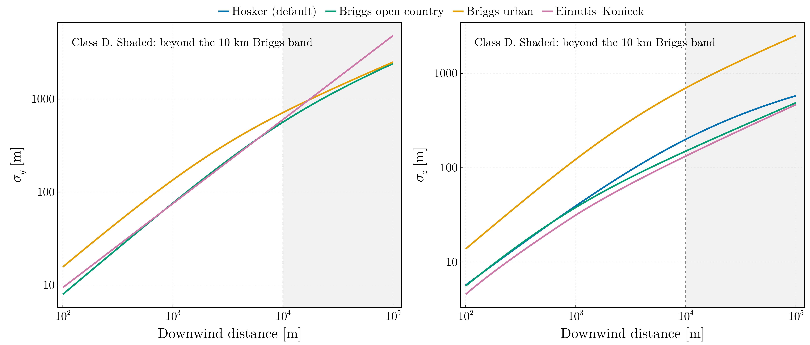

# AtmosphericDispersion.jl

[](https://PaulGoG.github.io/AtmosphericDispersion.jl/stable/)
[](https://PaulGoG.github.io/AtmosphericDispersion.jl/dev/)
[](https://github.com/PaulGoG/AtmosphericDispersion.jl/actions/workflows/CI.yml?query=branch%3Amain)
[](https://codecov.io/gh/PaulGoG/AtmosphericDispersion.jl)
[](https://github.com/JuliaTesting/Aqua.jl)

`atmospheric-dispersion` `gaussian-plume` `radiological-assessment` `dose-assessment` `nuclear-safety` `air-quality` `computational-physics` `julia`

Gaussian-plume atmospheric dispersion of radioactive stack releases: dilution
factor, time-integrated air concentration, dry and wet ground deposition, and
resuspension, over Pasquill–Gifford stability classes and a wind rose. Four
published dispersion schemes, each carrying the range of distance it was fitted
over; Briggs plume rise; a mixing layer; the building wake and cavity of IAEA
SRS-19. One TOML file describes a run, and every parameterisation is asserted
against its published source.


The ground-level plume as the wind direction sweeps the compass, class D. The
bearing is the direction the wind blows **from**, as in an ADMS `.met` file, so
the plume always lies on the far side of the stack: a northerly puts it south.
Averaging these over a year, weighted by how often the wind blows *towards* each
sector, is what the long-term field below is — and reading that weighting the
wrong way round is the single largest defect this rewrite fixes.

The solver core — plume rise, dispersion parameters, building wake, deposition
and resuspension — is nuclide-agnostic. Tritium (HTO/HT) release from a CANDU
stack is a parameterisation of it, and is the case the original work addressed.

## Layout

```
.
├── Project.toml, activate.jl   package manifest; activates the root environment
├── config/reference.toml       annotated run configuration, the CANDU tritium case
├── src/                        the solver, one file per physical component
├── scripts/                    run.jl for a configured run, figures.jl, validation.jl
├── test/                       unit, physics, literature and regulatory validation; Aqua, JET
├── docs/                       Documenter manual
└── figures/                    README figures and validation/, regenerated by scripts/
```

The full tree is [further down](#full-tree).

## Installation

Julia 1.10 or later. The package is not registered; install it by URL:

```julia
using Pkg
Pkg.add(url = "https://github.com/PaulGoG/AtmosphericDispersion.jl")
```

In a checkout, each environment carries its own activation script, which
activates and instantiates it silently, and every runnable script includes the
one it needs as its first statement, so nothing is run with `--project`. Expect
the first run of each environment to be slow.

```bash
julia -i activate.jl         # REPL in the root environment
julia -i test/activate.jl    # REPL in the test environment
```

## Entry points

```bash
julia scripts/run.jl config/reference.toml                                # long-term field for a run
julia -e 'include("test/activate.jl"); include("test/runtests.jl")'       # test suite and static QA
julia scripts/figures.jl                                                  # regenerate the README figures
julia scripts/validation.jl                                               # regenerate the validation figures
julia docs/make.jl                                                        # build the manual
julia -e 'using JuliaFormatter; format(".")'                              # apply the committed style; needs JuliaFormatter in the default environment
```

## Configuration

A run is described by a TOML file, never by editing source.
[`config/reference.toml`](config/reference.toml) is the annotated template:
ten tables, every key with its unit and bounds in a one-line comment. The
loader checks presence, type, enumerated choice and numerical bound, rejects
keys it does not read, and names the offending key by its full dotted path —
`ConfigurationError at \`grid.spacing\`: must be smaller than grid.extent
(20000.0 m), got 20000.0` — so a rejected file says what to change. Where
published schemes disagree, the choice is a key:

| Key | Choices | Default |
|---|---|---|
| `model.dispersion` | `hosker`, `briggs_open_country`, `briggs_urban`, `eimutis_konicek` | `hosker` |
| `model.extrapolation` | `warn`, `refuse`, `allow`, for a receptor grid outside the scheme's fitted range | `warn` |
| `model.plume_rise` | `briggs`, `xoqdoq`, `nsr23`, the constants the schemes disagree on | `briggs` |
| `model.stable_rise_wind` | `mean_over_rise`, `release_height`, the wind of the stable final rise | `mean_over_rise` |
| `model.resuspension` | `iaea_ss57`, `maxwell_anspaugh` | `iaea_ss57` |
| `model.washout` | `normative`, `hto`, the latter Ogram's snow scavenging of tritiated water | `normative` |
| `mixing_layer.scheme` | `tabulated`, `uniform`, `custom`, `unbounded` | `tabulated` |
| `mixing_layer.above_lid` | `rise_inhibited`, `full_penetration` | `rise_inhibited` |
| `wind_rose.convention` | `blowing_from`, `blowing_toward` | none: it must be stated |

A run that leaves the range its dispersion scheme was fitted over is announced
rather than silently extrapolated. The reference grid reaches 20 km, twice the
band of the default scheme, and says `allow`; under `warn` the loader reports

```
Warning: the receptor grid extrapolates DISPERSION_HOSKER past its stated validity range of 100.0–10000.0 m: grid.extent = 20000.0 m lies beyond its 10000.0 m upper end. Set model.extrapolation = "allow" to accept this silently
```

and under `refuse` the same sentence is a `ConfigurationError` at
`grid.extent`. The [configuration page](docs/src/api/configuration.md) of the
manual says what each choice means.

## What it produces


The long-term field for the reference configuration: tritium as HTO, 6.8 × 10¹⁴
Bq over a year, on a 30 × 30 km grid. The sixteen-fold structure is the wind
rose — the field is not circular because the frequency of transport towards each
sector is not uniform — and the southward bias is the rose peaking on winds
*from* the north. Reading the convention the other way reflects this map through
the origin, which is how a dose assessment ends up pointed at the wrong side of
a site.


Left: the three dilution regimes along the plume axis. The instantaneous and
extended forms agree closely near the axis, as they must — the sector average is
the crosswind integral of the three-dimensional field spread over the arc — and
the long-term field is flatter because it is averaged over every direction the
wind takes. All three vanish in the near field, where an elevated plume has not
yet reached the ground.

Right: the effective release height by stability class. Plume rise lifts the
50.3 m stack to between 101 and 112 m and saturates within half a kilometre,
higher in unstable air where the plume rises further before ambient turbulence
breaks it up. The stable final rise is evaluated with the wind averaged over the
depth of the rise, as the Handbook on Atmospheric Diffusion defines it: in
class D that mean is 6.66 m/s against 5.99 m/s at the stack top, which lowers
the effective height by 2 m relative to the release-height convention.

### What the parameters do

Four sweeps of the same release, each varying one thing. Every panel of a figure
shares one colour scale, so the comparison is quantitative rather than a set of
separately normalised pictures.

Two things make the differences legible. Half-decade **contours** are drawn over
each field, because a smooth ramp across three decades hides everything but the
largest changes and a contour that sits further out is a difference you can
measure. And the paired comparisons carry a third panel with the **ratio** of
the two fields on a diverging scale centred on one, where anything away from
white is a real change and the colour bar reads as a factor.


**Stability.** The single largest control on where the release lands. Class A
spreads it over a wide, dilute fan whose ground-level maximum sits 0.5 km out;
class F holds it in a narrow ribbon that does not peak until 15 km. The peak
values themselves differ by less than a factor of 3 — but *where* they fall moves
by a factor of 28, and at a fixed receptor the spread is enormous: at 20 km the
six classes span a factor of 37, and at 1 km class F is twelve orders of
magnitude below class B, because the plume has not yet reached the ground at all.
That is why an assessment stands or falls on the joint frequency of direction
*and* class rather than direction alone. Class F is also the one class the mixing
lid reaches here: its plume rises to 100.8 m under a 100 m lid, is held at it,
and gives about twice the ground-level value of an unbounded plume from 5 km
outwards.


**Building wake, worst case.** A 60 m building 25 m from a 50.3 m stack. The
wake criterion is a threshold, not a gradient: a stack clearing two and a half
building heights escapes untouched, one leaving *below* the building top is
entrained into the aerodynamic cavity and released at ground level. This
building is on the far side of it, so the effective release height goes from
**50.3 m to zero**. The third panel is the ratio of the two fields, on a scale
that saturates at ten: a factor of 20 on the axis at 1 km, 3.3 at 2 km, and still
1.6 at the 12 km edge of the map.


**Release height.** Raising the stack does not reduce the release, it moves the
ground-level maximum downwind and lowers it. Class D: 2.77 × 10⁻⁶ s m⁻³ at
1.7 km from a 30 m stack, 1.58 × 10⁻⁶ at 2.1 km from the 50.3 m reference
stack, and 4.31 × 10⁻⁷ at 4.2 km from 120 m — a factor of six off the peak for
four times the height.


**Depletion.** The same plume with and without radioactive decay, dry deposition
and an hour of washout. For HTO the loss is modest over this range — the decay
constant is 1.78 × 10⁻⁹ s⁻¹ and the deposition velocity 4 mm/s — but it
accumulates with distance, and the factors compose by multiplication, not
addition: 4 % at 1 km and 8 % at 20 km, of which the hour of rain is 3.5 %.
Again the ratio panel is what shows it: two fields differing by a few per cent
are indistinguishable on a ramp spanning three decades.

Regenerate all of them with `julia scripts/figures.jl`.

## Validation

The solver is checked against the analytic properties of the Gaussian plume
first, because these fail first if a normalisation, a reflection term or a
sector width is wrong: the crosswind integral, mass conservation across any
downwind plane, the sector average as the crosswind integral over the arc, and
the position of the ground-level maximum, each to machine precision under its
own assumptions. Every parameterisation is then asserted against its published
source, table entry by table entry: Briggs' σ_y and σ_z, Hosker's σ_z with all
48 coefficients of its roughness correction, the Eimutis–Konicek fit against
the XOQDOQ and PAVAN listings, Briggs' plume rise, the washout and resuspension
constants, and the long-term sector constant of Regulatory Guide 1.111 and of
SRS-19. Asserting the roughness table found two wrong coefficients in the
Romanian normative, which the 2021 code had carried faithfully; the package
follows Hosker.

Four published calculations are then run through the package end to end:

| Benchmark | What it exercises | Result |
|---|---|---|
| HPA-RPD-058 Table 3.7 | plume depletion by dry deposition: 3 release heights × 6 categories × 8 distances to 100 km | 143 of 144 cells within 0.028 of a table printed to 0.01; the exception is a depletion factor that rises with distance in the source |
| Turner (1970) Table 7-4 | the concentration profile with height at 1 km, both reflection terms | all 16 rows within 2.3 %, Turner's three-figure rounding |
| IAEA SRS-19 Tables I and II, Annex IV | the sector-averaged and the wake-corrected diffusion factors to one figure, and three worked examples on the building zones and cavity | 77 of 77 and 106 of 110 cells to the printed figure, the four others on a rounding boundary; the examples come out |
| NRC XOQDOQ Test Case 2 | the code's own continuous elevated release: a momentum jet over rising terrain, five wind classes, five stability classes | all 22 printed χ/Q within 0.05 %, the rounding of the four printed figures |



Where published schemes disagree, the figure shows by how much. The four
dispersion schemes in class D over pasture: Hosker, Briggs open country and
Eimutis–Konicek agree in σ_y and differ by up to a third in σ_z, and Briggs'
urban set is three times wider vertically at 2 km. The shaded region is beyond
the 10 km band the three Briggs-based schemes were fitted over, inside the
100 km of Eimutis–Konicek. Reading the primary documents settled one digit: the
Handbook on Atmospheric Diffusion misprints the urban E–F σ_z coefficient as
0.00015 where Briggs' own report and EPA ISC3 have 0.0015.

`figures/validation/` holds one figure per parameterisation, each drawn against
the published form it is meant to be. Where the test suite asserts an identity
the curves must lie on top of one another; where it only claims a bracket, the
figure is what shows how wide the bracket is.

| Figure | Against |
|---|---|
| `dispersion_parameters.png` | Briggs (1973) σ_y and σ_z, all six classes |
| `dispersion_schemes.png` | the four schemes for class D — Hosker, Briggs open country and urban, Eimutis–Konicek — across their validity ranges |
| `roughness_correction.png` | the published `(z₀/0.1)^0.2` scaling |
| `washout.png` | NRPB-R322 and AVV amplitudes, and the `J^0.75` law |
| `resuspension.png` | IAEA Safety Series 57, and its 2011 successor |
| `plume_rise.png` | Briggs final rise and the two-thirds law |
| `ground_level_maximum.png` | the peak and its position, class by class |

Regenerate with `julia scripts/validation.jl`.

## Documentation

The derivations and the evidence are in the documentation, under `docs/src/`:

- [Conventions](docs/src/conventions.md): the wind-direction convention and what getting it wrong costs; why depletion factors multiply.
- [Validation](docs/src/validation.md): every parameterisation against its published source, the four end-to-end benchmarks, the mixing layer, and where published schemes disagree.
- [The 2021 thesis code](docs/src/thesis.md): what the rewrite changed and how far the original results move.
- API reference: `docs/src/api/`.
- [References](docs/src/references.md): every source cited, by DOI where one exists; the list itself is rendered in the built documentation from `docs/src/refs.bib`.

Build it locally with `julia docs/make.jl`.

## Status

The solver is complete, configuration-driven, and validated as above. What each
component follows:

| Component | Follows |
|---|---|
| Sector geometry and wind rose | sectors centred on the cardinal directions; the direction convention is declared, never assumed |
| Dispersion parameters | Briggs (1973) open country and urban; Hosker (1974) with the roughness correction, the normative's default; Eimutis and Konicek (1972); each with the range it was fitted over |
| Plume rise | Briggs, momentum and buoyancy; the stable final rise on the mean wind over the rise; the XOQDOQ and NSR-23 constants selectable |
| Buildings | the displacement, wake and cavity zones of SRS-19 §3.3; wake broadening with the SRS-19 and AVV coefficient; the two cavity forms of §3.6 |
| Mixing layer | the image sum of HPA-RPD-058 §3.2.2.1 to double precision, its Table 3.5(a) depths; a plume above the lid held at it (NRPB-R157) or leaving the layer (EPA ISC3) |
| Dilution | instantaneous, sector-averaged with the constant of RG 1.111 or SRS-19, and long term over the rose |
| Depletion and deposition | decay, dry deposition, NSR-23 Table 7 washout with Slinn's J^0.75 law and Ogram's snow scavenging of HTO; dry and wet deposition; Safety Series 57 or Maxwell–Anspaugh resuspension |
| `Site` and `PrescribedPlume` | the per-run precomputation, and a plume whose height, wind or σ a published benchmark states |
| Quality | Aqua, JET and ExplicitImports in the suite; 6906 assertions; CI on the LTS, the current and the pre-release Julia; the manual built with its doctests |

Not yet carried:

- A stability category G, which XOQDOQ and HPA-RPD-058 both carry and this
  package does not
- The Prairie Grass crosswind-integrated concentrations, whose disputed
  roughness length sits directly under Hosker's correction
- Fumigation of a plume that has risen above the lid, which neither lid rule
  models

One caveat on the reference case. Its wind rose is not a measured rose for a
site: the frequencies came from meteorological data for the Pitești fuel plant
and the Cernavodă NPP, read in 2021 under the convention this package now
refuses to assume. The convention is fixed; the numbers remain an illustrative
case and the configuration says so rather than implying a site.

## Full tree

<details>
<summary>Every tracked file</summary>

```
.
├── Project.toml            package manifest and [compat]
├── activate.jl             activates and instantiates the root environment
├── CHANGELOG.md            what changed, release by release
├── CITATION.cff            citation metadata, rendered by GitHub
├── LICENSE                 MIT
├── .JuliaFormatter.toml    the committed formatting style, SciMLStyle
├── .gitattributes, .gitignore
├── config/
│   └── reference.toml      the CANDU tritium case, with bounds in the comments
├── figures/
│   ├── *.png, *.gif        the README figures and animations, from scripts/figures.jl
│   └── validation/         one figure per parameterisation, from scripts/validation.jl
├── scripts/
│   ├── Project.toml        plotting environment, kept out of the package
│   ├── activate.jl
│   ├── theme_common.jl     figure style shared by the scripts below
│   ├── run.jl              long-term field for a configured run
│   ├── figures.jl          the figures above
│   └── validation.jl       every parameterisation against its published form
├── src/
│   ├── AtmosphericDispersion.jl   module, includes and exports
│   ├── sectors.jl          wind-rose sector geometry
│   ├── stability.jl        Pasquill–Gifford stability classes
│   ├── windrose.jl         directional and stability joint frequencies
│   ├── surfaces.jl         surface, roughness and precipitation categories
│   ├── tables.jl           tabulated coefficients of the normative
│   ├── mixing.jl           mixing-layer depth and the lid reflections
│   ├── dispersion.jl       wind profile, the four dispersion schemes, validity ranges
│   ├── source.jl           stack, ambient state, fluxes, stability parameter
│   ├── plumerise.jl        momentum and buoyancy rise
│   ├── buildings.jl        building envelope, wake broadening, the SRS-19 zones
│   ├── site.jl             release height and the per-run precomputation
│   ├── dilution.jl         the three dilution regimes and the two cavity forms
│   ├── nuclides.jl         species: decay constant and deposition velocity
│   ├── depletion.jl        decay, dry deposition and washout
│   ├── deposition.jl       ground deposition and resuspension
│   └── config.jl           TOML loader, validated key by key
├── test/
│   ├── Project.toml
│   ├── activate.jl
│   ├── runtests.jl         includes the files below, in dependency order
│   ├── fixtures.jl         the reference stack, atmosphere and site the suite shares
│   ├── test_quality.jl     Aqua, JET, ExplicitImports
│   ├── test_<source>.jl    one file per source file: sectors, stability, windrose,
│   │                       tables, dispersion, source, plumerise, buildings, site,
│   │                       mixing, dilution, depletion, deposition, config
│   ├── test_physics_validation.jl   analytic invariants of the Gaussian plume
│   ├── test_literature.jl  published tables and constants, source by source
│   └── test_regulatory.jl  SRS-19's tables and examples and XOQDOQ's test case, end to end
├── docs/
│   ├── Project.toml
│   ├── activate.jl
│   ├── make.jl             Documenter build
│   └── src/
│       ├── index.md        overview and a worked run
│       ├── conventions.md  the wind-direction convention, and why depletion multiplies
│       ├── validation.md   the analytic invariants and every published comparison
│       ├── thesis.md       the 2021 code, and how far its results move
│       ├── references.md, refs.bib   the bibliography, DOI-keyed
│       └── api/            four API pages
└── .github/                CI workflow and Dependabot configuration
```

</details>

## History

The [`original`](../../tree/original) branch holds the code as submitted for
the BSc thesis at the Faculty of Physics, University of Bucharest, in June 2021,
its files under English names since 2026 with the submitted names mapped in its
README, together with the thesis itself (`BSc_thesis_2021.pdf`, in Romanian).
`main` shares no history with it. Run both ways on the CANDU case, three of the
corrections move the result: the wind-direction convention by a half turn and a
factor of 1.51, the mixing layer by up to +22 % at 20 km, and the stable rise
on the mean wind by 5 % at 1 km. The account is in
[docs/src/thesis.md](docs/src/thesis.md), and the changes release by release
are in [CHANGELOG.md](CHANGELOG.md).

## How to cite

`CITATION.cff` carries the metadata; GitHub renders it as a citation block.

```bibtex
@software{Gogita_AtmosphericDispersion_jl,
  author  = {Gogîță, Paul-Adrian},
  title   = {AtmosphericDispersion.jl: Gaussian-plume atmospheric dispersion of stack releases},
  year    = {2026},
  version = {0.3.0},
  url     = {https://github.com/PaulGoG/AtmosphericDispersion.jl}
}
```

## Licence

MIT, see `LICENSE`.
