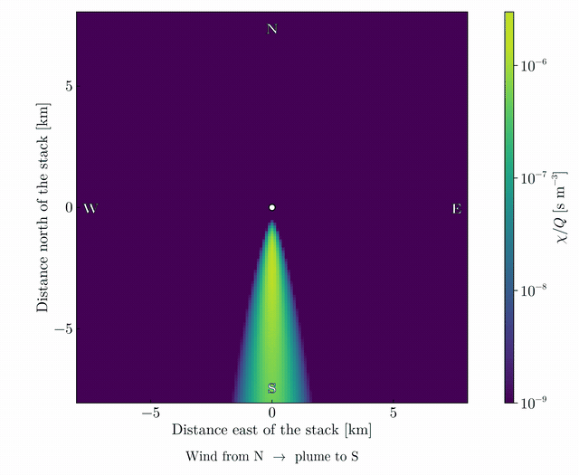
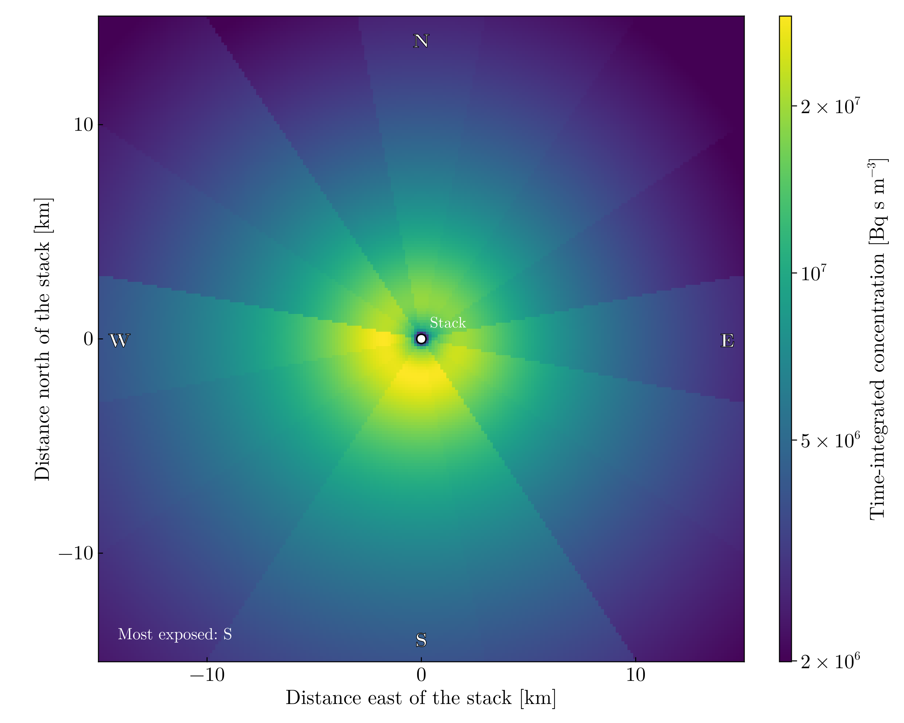
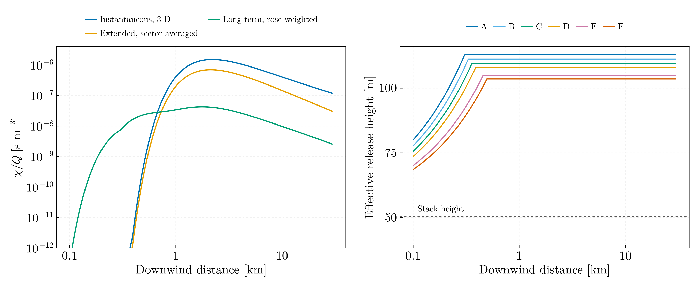
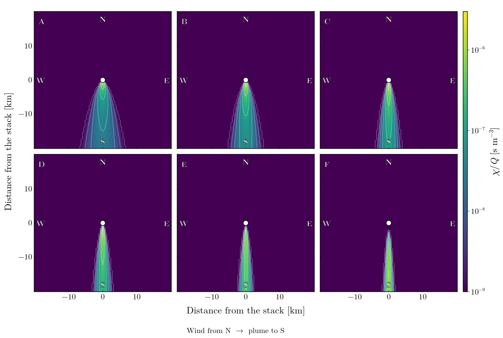
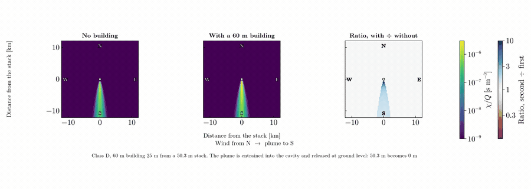
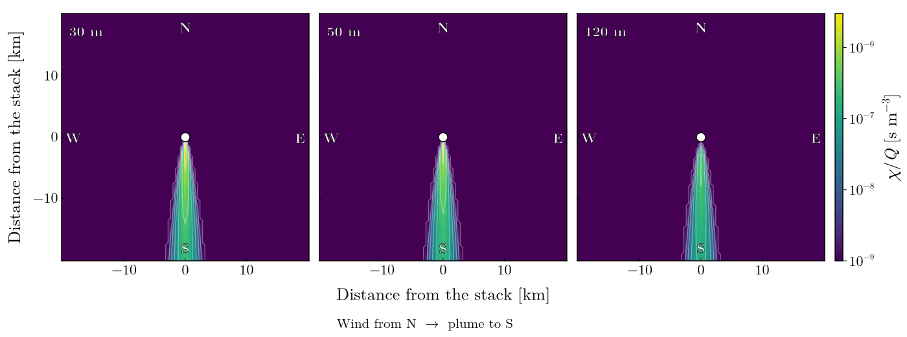
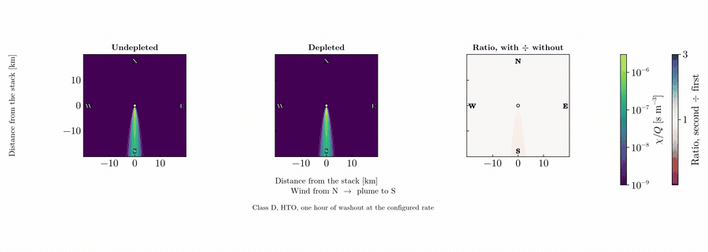

# AtmosphericDispersion.jl

[](https://PaulGoG.github.io/AtmosphericDispersion.jl/stable/)
[](https://PaulGoG.github.io/AtmosphericDispersion.jl/dev/)
[](https://github.com/PaulGoG/AtmosphericDispersion.jl/actions/workflows/CI.yml?query=branch%3Amain)
[](https://codecov.io/gh/PaulGoG/AtmosphericDispersion.jl)
[](https://github.com/JuliaTesting/Aqua.jl)

Gaussian-plume atmospheric dispersion of radioactive stack releases: dilution
factor, time-integrated air concentration, dry and wet ground deposition, and
resuspension, over Pasquill–Gifford stability classes and a wind rose.



The ground-level plume as the wind direction sweeps the compass, class D. The
bearing is the direction the wind blows **from**, as in an ADMS `.met` file, so
the plume always lies on the far side of the stack: a northerly puts it south.
Averaging these over a year, weighted by how often the wind blows *towards* each
sector, is what the long-term field below is — and reading that weighting the
wrong way round is the single largest defect this rewrite fixes.

The solver core — plume rise, Briggs dispersion parameters, building wake,
deposition and resuspension — is nuclide-agnostic. Tritium (HTO/HT) release from
a CANDU stack is a parameterisation of it, and is the case the original work
addressed.

## What it produces



The long-term field for the reference configuration: tritium as HTO, 6.8 × 10¹⁴
Bq over a year, on a 30 × 30 km grid. The sixteen-fold structure is the wind
rose — the field is not circular because the frequency of transport towards each
sector is not uniform — and the southward bias is the rose peaking on winds
*from* the north. Reading the convention the other way reflects this map through
the origin, which is how a dose assessment ends up pointed at the wrong side of
a site.



Left: the three dilution regimes along the plume axis. The instantaneous and
extended forms agree closely near the axis, as they must — the sector average is
the crosswind integral of the three-dimensional field spread over the arc — and
the long-term field is flatter because it is averaged over every direction the
wind takes. All three vanish in the near field, where an elevated plume has not
yet reached the ground.

Right: the effective release height by stability class. Plume rise lifts the
50.3 m stack to between 103 and 112 m and saturates within a kilometre, higher
in unstable air where the plume rises further before ambient turbulence breaks
it up.

### What the parameters do

Four sweeps of the same release, each varying one thing. Every panel of a figure
shares one colour scale, so the comparison is quantitative rather than a set of
separately normalised pictures.

Two things make the differences legible. Half-decade **contours** are drawn over
each field, because a smooth ramp across three decades hides everything but the
largest changes and a contour that sits further out is a difference you can
measure. And the paired comparisons carry a third panel with the **ratio** of
the two fields on a diverging scale centred on one, where anything away from
white is a real change and the colour bar reads as a factor.



**Stability.** The single largest control on where the release lands. Class A
spreads it over a wide, dilute fan whose ground-level maximum sits 0.5 km out;
class F holds it in a narrow ribbon that does not peak until 16 km. The peak
values themselves differ by only a factor of 5.9 — but *where* they fall moves by
a factor of thirty, and at a fixed receptor the spread is enormous: at 20 km the
six classes span a factor of 25, and at 1 km class F is thirteen orders of
magnitude below class B, because the plume has not yet reached the ground at all.
That is why an assessment stands or falls on the joint frequency of direction
*and* class rather than direction alone.



**Building wake, worst case.** A 60 m building 25 m from a 50.3 m stack. The
wake criterion is a threshold, not a gradient: a stack clearing two and a half
building heights escapes untouched, one leaving *below* the building top is
entrained into the aerodynamic cavity and released at ground level. This
building is on the far side of it, so the effective release height goes from
**50.3 m to zero**. The building is marked on the map, and the third panel is
the ratio of the two fields — up to ten times more at ground level near the
source, converging to one far downwind.



**Release height.** Raising the stack does not reduce the release, it moves the
ground-level maximum downwind and lowers it. Class D: 2.57 × 10⁻⁶ s m⁻³ at
1.74 km from a 30 m stack, 1.51 × 10⁻⁶ at 2.21 km from the 50.3 m reference
stack, and 4.26 × 10⁻⁷ at 4.22 km from 120 m — a factor of six off the peak for
four times the height.



**Depletion.** The same plume with and without radioactive decay, dry deposition
and an hour of washout. For HTO the loss is modest over this range — the decay
constant is 1.78 × 10⁻⁹ s⁻¹ and the deposition velocity 4 mm/s — but it
accumulates with distance, and the factors compose by multiplication, not
addition. Again the ratio panel is what shows it: two fields differing by tens
of per cent are indistinguishable on a ramp spanning three decades.

Regenerate all of them with `julia --project=scripts scripts/figures.jl`.

### Validation figures

`figures/validation/` holds one figure per parameterisation, each drawn against
the published form it is meant to be. Where the test suite asserts an identity
the curves must lie on top of one another; where it only claims a bracket, the
figure is what shows how wide the bracket is.

| Figure | Against |
|---|---|
| `dispersion_parameters.png` | Briggs (1973) σ_y and σ_z, all six classes |
| `roughness_correction.png` | the published `(z₀/0.1)^0.2` scaling |
| `washout.png` | NRPB-R322 and AVV amplitudes, and the `J^0.75` law |
| `resuspension.png` | IAEA Safety Series 57, and its 2011 successor |
| `plume_rise.png` | Briggs final rise and the two-thirds law |
| `ground_level_maximum.png` | the peak and its position, class by class |

Regenerate with `julia --project=scripts scripts/validation.jl`.

## Layout

```
.
├── Project.toml            package manifest and [compat]
├── activate.jl             activates and instantiates the root environment
├── config/
│   └── reference.toml      the CANDU tritium case, with bounds in the comments
├── figures/                README figures and animations, from scripts/figures.jl
├── scripts/
│   ├── Project.toml        plotting environment, kept out of the package
│   ├── activate.jl
│   ├── theme_common.jl     figure style shared by the scripts below
│   ├── run.jl              long-term field for a configured run
│   ├── figures.jl          the figures above
│   └── validation.jl       every parameterisation against its published form
├── src/
│   ├── AtmosphericDispersion.jl   module, includes and exports
│   ├── sectors.jl          wind-rose sector geometry
│   ├── stability.jl        Pasquill–Gifford stability classes
│   ├── windrose.jl         directional and stability joint frequencies
│   ├── surfaces.jl         surface, roughness and precipitation categories
│   ├── tables.jl           tabulated coefficients of the normative
│   ├── dispersion.jl       wind profile and dispersion parameters
│   ├── source.jl           stack, ambient state, fluxes, stability parameter
│   ├── plumerise.jl        momentum and buoyancy rise
│   ├── buildings.jl        building envelope and wake broadening
│   ├── site.jl             release height and the per-run precomputation
│   ├── dilution.jl         the three dilution regimes
│   ├── nuclides.jl         species: decay constant and deposition velocity
│   ├── depletion.jl        decay, dry deposition and washout
│   ├── deposition.jl       ground deposition and resuspension
│   └── config.jl           TOML loader, validated key by key
├── test/
│   ├── Project.toml
│   ├── activate.jl
│   └── runtests.jl         unit tests + Aqua, JET, ExplicitImports
├── docs/
│   ├── Project.toml
│   ├── activate.jl
│   ├── make.jl             Documenter build
│   └── src/                overview and four API pages
└── .github/workflows/      CI, TagBot (dependency bumps come from Dependabot)
```

## Environments

Each environment carries its own activation script, which activates and
instantiates it silently. Expect the first run of each to be slow.

```bash
julia activate.jl            # root
julia test/activate.jl       # test environment
julia docs/activate.jl       # documentation environment
julia scripts/activate.jl    # plotting environment
```

## Entry points

```bash
julia --project scripts/run.jl config/reference.toml  # long-term field for a run
julia --project=scripts scripts/figures.jl            # regenerate the figures
julia --project=scripts scripts/validation.jl        # regenerate the validation figures
julia --project -e 'using Pkg; Pkg.test()'            # test suite and static QA
julia --project=docs docs/make.jl                      # build the documentation
julia -e 'using JuliaFormatter; format(".")'           # apply the committed style
```

A run is described by a TOML file, never by editing source. The loader checks
presence, type, enumerated choice and numerical bound, and names the offending
key by its full dotted path — `ConfigurationError at \`grid.spacing\`: must be
smaller than grid.extent (20000.0 m), got 20000.0` — so a rejected file says
what to change.

## The wind-direction convention

A wind direction carries a convention that its magnitude does not reveal, and
getting it wrong rotates a long-term dispersion field by half a turn while
leaving every magnitude, sum rule and unit intact. Three things had to be fixed
relative to the 2021 code, and they are independent of one another.

**Sense.** ADMS, and every measured wind rose, gives the direction the wind
blows *from*. The long-term sector-averaged formula weights by the frequency of
wind blowing *towards* the receptor's sector. `WindRose` therefore takes the
convention as a required argument — `BlowingFrom()` or `BlowingToward()` — and
stores blowing-towards internally, so the formulae cannot be fed the wrong
sense. There is no default.

**Frame.** The 2021 code indexed sectors from `atan(y/x)`, counterclockwise from
east. The compass runs clockwise from north. Mapping a cardinal table onto those
indices is a reflection as well as a rotation, so a table indexed N, NNE, NE, …
could not be fed in as k = 1, 2, 3, … under any sign convention.

**Binning.** The 2021 sectors began at a sector edge, which put every cardinal
direction exactly on a boundary, where `floor` on a ratio that came out one ulp
low decided the bin. ESE and SE collapsed into one sector, SSW and SW into
another, and two of the sixteen sectors became unreachable. Sectors here are
centred on the cardinal directions and binned by rounding to the nearest centre,
so a cardinal direction sits as far from a boundary as it can and bins exactly.

The thesis anticipated this last hazard and `SectoareCerc.jl` was written to
check it, but that script sampled a *random* point on the circle, which almost
surely never lands on a boundary — so the test could not detect the failure it
was written for. All sixteen cardinal directions, and both sides of every
boundary, are now asserted explicitly.

## What the convention costs

Reading the 2021 frequency table under the two conventions, everything else
held fixed, the long-term dilution factor at 1 km differs by up to a factor of
**1.63**, and the most-exposed sector moves from **N** to **S** — exactly
opposite, as it must. For a dose assessment the sector that matters is the
most-exposed one, so this is not a refinement: it points the assessment at the
wrong side of the site.

**The author has since confirmed he misunderstood the convention at the time.**
The table is therefore a *blowing-from* rose, which is what every published wind
rose is, and the 2021 code consumed it as *blowing-toward*. The 2021 dose field
is rotated by half a turn, and its most-exposed sector is the least-exposed one.
`config/reference.toml` declares `blowing_from` accordingly.

The provenance of the numbers is still open: his recollection is that they are
either placeholder values or real meteorological data for the Pitești fuel plant
or the Cernavodă NPP site. Read in standard cardinal order the rose is
north-dominated — 30.6 % of the time in the N quadrant against 19.8 % in the S,
strongest from N, NNE and E, weakest from SSW and SW — which is the right shape
for Dobrogea, where the crivăț blows from the north-east. That is consistent
with the Cernavodă branch of his recollection but does not establish it: the
rose is also unusually flat for a real site, only 1.7:1 between its strongest
and weakest sectors, where measured roses are typically more peaked. Treat the
absolute frequencies as unverified; the *convention* is not.

## Depletion composes by multiplication

A second defect, independent of the wind rose and provable the same way — by a
limit. The 2021 code combined the wet and dry depletion factors additively,

    χ = χ/Q · Q · DEC · (DEP_w + DEP_d)

Switch the rain off and set the deposition velocity to zero, so nothing is
removed at all: each factor tends to one, their sum tends to two, and the
concentration comes out twice the undepleted value. Surviving fractions
multiply — the processes act in sequence on the same material.

The long-term dry factor had the same shape of error at larger scale. It summed
six exponentials, one per stability class, with the frequencies inside the
exponent and no weighting outside, so in the no-deposition limit it tended to
six rather than one. Depletion is class-dependent through both the transport
speed and the vertical dispersion, so it belongs inside the class sum, and that
is where it now sits.

Both limits are asserted in the suite.

A third defect of the same kind sits in the wet deposition. Integrating the
Gaussian plume over the whole vertical column leaves a normalisation of
`√(2π) Σ_y u`; the 2021 code wrote `√2 π Σ_y u`. The ratio of the two is
exactly `√π`, the signature of `√(2π)` mistyped as `√2·π`, and it understated
wet deposition by a factor of 1.772.

## Validation

The solver is checked against the analytic properties of the Gaussian plume, not
only against itself. These are the statements that fail first if a
normalisation, a reflection term or a sector width is wrong.

| Check | Result |
|---|---|
| Crosswind integral equals `2exp(−H²/2Σ_z²)/(√(2π) Σ_z u)` | exact to 1 part in 10⁸ |
| Mass conservation, `u ∫∫ χ/Q dy dz = 1` | **1.000000000** |
| Sector average equals the crosswind integral over the arc | exact to 1 part in 10¹⁰ |
| Ground-level maximum at `Σ_z = H/√2` | exact under its own assumptions |

Mass conservation is the strongest of them: it says the released activity
crossing any downwind plane, carried at the transport speed, is the whole
release — which exercises the 2πΣ_yΣ_z normalisation, the ground reflection and
the transport speed together.

### Against the published literature

Every parameterisation the normative hands down turns out to be a standard
published scheme. Where they are, the identity is asserted rather than
described.

| | Published form | Agreement |
|---|---|---|
| σ_y | Briggs (1973) open country, `a x(1+10⁻⁴x)^(−1/2)`, a = 0.22…0.04 | **exact**, all six classes |
| σ_z shape `g(x)` | Hosker (1974), `a x^b/(1 + c x^d)` | **exact**, all 24 coefficients |
| σ_z roughness `F(z₀,x)` | Hosker (1974), both branches | **exact**, all 24 coefficients — after correcting two |
| Long-term sector constant | NRC RG 1.111 `2.032`, IAEA SRS-19 `1.5238` | **exact to the published rounding** |
| Distance to final rise | Briggs `x_f = 14F^(5/8)`, `34F^(2/5)` | **exact** |
| Neutral final buoyant rise | Briggs `21.4F^(3/4)/u`, `38.7F^(3/5)/u` | **exact up to the literature's own rounding** |
| Stable final rise | Briggs `2.6[F/(us)]^(1/3)` | **exact** |
| Transitional rise | the two-thirds law `1.6F^(1/3)x^(2/3)/u` | **exact** |
| Combined rise | Briggs, `3F_m x/β_j²u² + 3F x²/2β²u³` | momentum half exact, **buoyancy half 13.6 % high** |

#### The vertical dispersion scheme, and two wrong digits

`σ_z = g(x)F(z₀,x)` is Hosker's analytic fit to F.B. Smith (1972) and Briggs
(1973), published as IAEA-SM-181/19 in *Physical Behaviour of Radioactive
Contaminants in the Atmosphere* (IAEA, Vienna, 1974). The normative reproduces
it without attribution. It is printed in full in **HPA-RPD-058** (Health
Protection Agency, 2009) Table 3.3 and **NRPB-R91** (1979) Table 3, and both
printings agree digit for digit.

Asserting the whole table against those printings found **two transcription
errors** in the roughness correction, carried over from the 2021 tables:

| z₀ | was | published | effect on σ_z |
|---|---|---|---|
| 0.01 m, grassland and water | 1.58 | **1.56** | 1.9 % too large |
| 0.04 m, arable | 2.08 | **2.02** | 3.6 % too large |

The other 22 coefficients, and all 24 of the shape function, were already exact.
This is the argument for asserting tables of constants entry by entry rather
than sampling them: nothing else in the suite could have caught it, because the
error is in the data, not the algebra.

#### The long-term equation is a regulatory one

`dilution_long_term` is not a bespoke form. The same equation, constant
included, is stated by **NRC Regulatory Guide 1.111** Rev. 1 (1977) Eq. (3) and
its implementation **XOQDOQ** (NUREG/CR-2919, 1982) Eq. (1), by **IAEA Safety
Reports Series No. 19** (2001) Eq. (V-2), and by the German **AVV zu §47
StrlSchV** (2012) Eq. (4.4). RG 1.111 writes the sector constant as `2.032` and
says in words that it is `√(2/π)` divided by a 22.5° sector in radians; SRS-19
works in twelve sectors, where the same constant is `1.5238`. Both are asserted,
for every class and distance.

`dilution_instantaneous` is likewise SRS-19 Eq. (V-1) literally.

#### The depletion and resuspension parameters

These were the last constants in the package with no attribution. They have one
now.

**Resuspension.** `K = A exp(−λ₁t) + B exp(−λ₂t)` with
`A = 10⁻⁵ m⁻¹, B = 10⁻⁹ m⁻¹, λ₁ = 10⁻² d⁻¹, λ₂ = 2 × 10⁻⁵ d⁻¹` is **IAEA Safety
Series No. 57** (1982), §3.6, Eq. (3.14A) — all four constants, exactly, in the
same units. That report also brackets them: A over 10⁻⁶–10⁻⁴ and B over
10⁻¹⁰–10⁻⁸ m⁻¹, with the fast half-life "of the order of weeks" (this gives
69.3 d) and the slow one "in the range 50 to 100 years" (94.9 yr). Asserted.

A later model supersedes it — Maxwell and Anspaugh, *Health Physics* **101**
(2011), also in NUREG/CR-7270 — which keeps the amplitudes but puts the fast
decay constant at 0.07 d⁻¹ rather than 0.01. The package therefore runs high
with elapsed time: 1.8× at ten days, 6× at thirty. Recorded, not changed.

**Washout.** The table is not arbitrary. Fitting each column in log–log gives an
exponent of **0.753** for three of the four and 0.691 for the fourth, within
10 % — and `Λ ∝ J^0.75` is the published dependence, from Slinn (1977) via
**NRPB-R322** (ADMLC, 2001) §3.1.1. The amplitudes bracket the published values
rather than reproducing one: at 1 mm/h the German **AVV zu §47 StrlSchV** (2012)
Anhang 7 Tabelle 3 gives 7 × 10⁻⁵ s⁻¹ for aerosols and elemental iodine and
3.5 × 10⁻⁵ for tritiated water, and **both fall inside this table's
low-to-high range of 10⁻⁵ to 2 × 10⁻⁴**. Asserted as a bracket, which is what it
is.

**And one thing the sourcing exposed.** The snow columns are the rain columns
divided by exactly 100 and 500 — a particle-scavenging suppression, sensible for
aerosols. For HTO it is the wrong physics: snow scavenging of tritiated water is
isotopic exchange at the crystal surface, and the only HTO-specific measurement
found (Ogram, Ontario Hydro 85-233-K, 1985, Table V) runs about **1000× above**
this table's snow column, not below it. The reference case is HTO. This is
flagged in the status list rather than silently corrected, because the right
value depends on a decision about what the table is for.

#### Where schemes disagree, the choice is in the configuration

Three plume-rise constants differ between published schemes, and the 2021 code
took a position on each without recording one. They are now a `RiseCoefficients`
value selected by `[model] plume_rise`, defaulting to Briggs:

| | Briggs, the default | 2021 code | Also published |
|---|---|---|---|
| Combined-law buoyancy denominator | **0.72** = 2β², β = 0.6 | 0.5 | — |
| Neutral momentum rise, `c w₀D/u` | **3** — Briggs (1969) Eq. 5.2, EPA ISC3 Eq. (1-16) | 1.5, unsourced | — |
| Stable final rise, `c[F/(uS)]^(1/3)` | **2.6** — Briggs, Handbook on Atmospheric Diffusion | 2.6 | 2.4, NRC XOQDOQ |

The first is the one that matters. The combined momentum-and-buoyancy law must
reduce to the pure-buoyancy law when the momentum flux vanishes, and with 0.5 it
did not: it left `(6F x²/u³)^(1/3)` against the two-thirds law's
`(1.6³F x²/u³)^(1/3)`, an overshoot of **13.6 %**. The momentum half of the same
expression was already exactly Briggs — `β_j = 1/3 + u/w₀` — which placed the
discrepancy in the buoyancy half alone, and two independent routes give the
correction: `2β² = 0.72` and `3/1.6³ = 0.7324`.

With 0.72 the law reduces as it should, to within **0.6 %** — the residual being
that `(3/0.72)^(1/3) = 1.60915` where the literature rounds the two-thirds
coefficient to 1.6, the same rounding that makes the neutral final rise 21.425
against a published 21.4.

`plume_rise = "thesis_2021"` restores the old constants exactly, and the
fidelity tests use it, so the 2021 results remain reproducible.

**The reference case does not move**, and that is worth saying rather than
leaving as a surprise: the CANDU stack is buoyancy-dominated — 57.7 m of buoyant
rise against 10.6 m of momentum rise in class D, an imbalance far outside the
tolerance for the combined law — so it takes the pure-buoyancy branch, which
none of these constants touch. The correction bites on momentum-dominated and
balanced releases, which is where the 13.6 % was.

Selecting `xoqdoq` does move it: the reference atmosphere is stably stratified,
so the stable branch is active, and the effective release height at 2 km in
class D falls from 108.0 m to 103.6 m.

Resuspension is selectable the same way: `[model] resuspension` takes
`iaea_ss57` (the default, Safety Series 57) or `maxwell_anspaugh` (2011, also
NUREG/CR-7270).

The building-wake coefficient was already configurable. Its default of 1.5 is
the 2021 value and no source was found for it; AVV Eqs. (4.31)/(4.32) and
SRS-19 Eq. (6) both use 1.0 in the same position, and RG 1.111 Eq. (9) applies
0.5 to the building height instead. The config comment now says so.

The third row is worth a note. This code writes the neutral final rise as
`1.6F^(1/3)(3.5x_f)^(2/3)/u`, which does not look like the published
`21.4F^(3/4)/u`. Substituting `x_f = 14F^(5/8)` collapses it: `1.6·49^(2/3) =
21.425`, and `1.6·119^(2/3) = 38.71` for the other branch. They are one
expression, and the literature rounds the constant. The tests assert both the
algebra and the numbers.

σ_z is not Briggs — it is Hosker, as above, carrying an explicit roughness
correction that Briggs does not have. So the package mixes **Briggs σ_y with
Hosker σ_z**, a pairing no single publication uses, and the two are therefore
asserted against different sources. Against Briggs, σ_z is only bracketed: the
ratio runs from **0.41** (class B at 10 km) to **1.49** (class E at 10 km) over
0.1–10 km, a factor of 2.4 taken symmetrically, and it is systematically ordered
— less vertical spread than Briggs in unstable air, more in stable, closest in
neutral. That is the spread that separates published σ schemes from one another,
and `figures/validation/dispersion_parameters.png` is the picture of it.

The last check needs a word. `Σ_z = H/√2` is derived holding `H` fixed and
`Σ_y ∝ Σ_z`; asserted under those assumptions it is exact. In the real field the
maximum lands 5 % away from it, and the cause is not error but `Σ_y/Σ_z`
drifting from 1.94 to 2.43 across the peak region while plume rise has already
saturated. All six Pasquill classes and three sector counts are covered.

## Status

The solver is complete, configuration-driven and validated against the analytic
invariants.

Done:

- Sector geometry, Pasquill classes, and the wind rose with its explicit
  direction convention
- Surface and roughness categories; the coefficient tables as compile-time
  constants rather than DataFrame lookups in the inner loop
- Wind profile and dispersion parameters; plume rise; building wake
- `Site`, which precomputes everything independent of receptor position
- The three dilution regimes: instantaneous, extended, long term
- Nuclides, and depletion by decay, dry deposition and washout
- Dry and wet ground deposition, and resuspension
- TOML configuration validated key by key, and a script entry point over it
- Physics validation against the analytic invariants of the Gaussian plume, and
  against the published Briggs, Hosker and regulatory parameterisations
- Static QA in the suite: Aqua, JET, ExplicitImports. 3286 tests, including
  exact agreement with the 2021 formulae wherever they were evaluable and the
  one place they deliberately diverge
- A Documenter site that builds clean, doctests included

Next:

- Establish the provenance of the 2021 wind rose — the convention is settled,
  the numbers are not
- Re-run the thesis cases under the corrected convention and the corrected
  roughness coefficients, to say by how much the published dose maps move
- Decide what the snow washout column should be for HTO. It is currently the
  rain column divided by 500, a particle-scavenging suppression, and the only
  HTO-specific measurement found runs three orders of magnitude the other way
- A mixing lid. Its absence is what limits agreement with published depletion
  tables beyond about 20 km

## History

The [`original`](../../tree/original) branch holds the code exactly as submitted
for the BSc thesis at the Faculty of Physics, University of Bucharest, in June
2021, together with the thesis itself (`BSc_thesis_2021.pdf`, in Romanian).
`main` shares no history with it.

## Citing

`CITATION.cff` carries the metadata; GitHub renders it as a citation block.

## Licence

MIT, see `LICENSE`.
