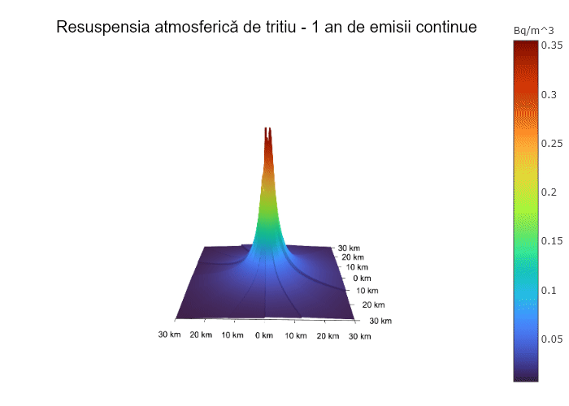

# AtmosphericDispersion.jl — `original`

This branch is the BSc thesis code as submitted to the Faculty of Physics,
University of Bucharest in June 2021, together with the thesis it belongs to.
It is kept as a reference point. `main` is a rewrite and carries no history from
here.

Nothing on this branch has been repaired. Identifiers, comments and output
strings are in Romanian, file paths use Windows separators and will not resolve
on Linux, and the numerical and structural defects listed below are left in
place deliberately. The one change since submission is to the names: the files
and directories carry English names, and the `include` and data-path strings
that name them were changed to match. The mapping is [below](#file-names).

## What it computes

Atmospheric dispersion of tritium released from the stack of a CANDU-type
nuclear power plant, as tritiated water vapour (HTO) and tritiated hydrogen
(HT), following the Romanian regulatory norm NSR-23 (CNCAN, 2004).

A Gaussian plume is evaluated over a 60 × 60 km grid at 150 m resolution, in
three emission regimes selected by release duration:

| Regime | Duration | Model |
|---|---|---|
| Instantaneous / short | ≤ 1 h | Continuous 3-D Gaussian field |
| Extended | 1–24 h | Sector-averaged at ground level |
| Long | > 24 h | Wind-rose-weighted over Pasquill classes |

The chain is: atmospheric dilution factor χ/Q [s m⁻³] → time-integrated air
concentration χ [Bq s m⁻³] → ground deposition ω [Bq m⁻²] → resuspension
[Bq m⁻³], each corrected for radioactive decay and for dry and wet deposition.

Physics implemented: Pasquill–Turner stability classes, Briggs dispersion
parameters σ_y and σ_z with surface-roughness correction, plume rise from
momentum and buoyancy with transition and final phases, stack downwash, building
wake entrainment, dry deposition by the source-depletion integral, wet
deposition by washout coefficient, and the two-component resuspension factor
K(t) = A e^{−λ₁t} + B e^{−λ₂t}.

## Files

| File | Role |
|---|---|
| `Main.jl` | Entry point. Sets release time, stability class, terrain, precipitation, grid |
| `Constants.jl` | Physical and installation constants |
| `Read_data.jl` | Loads the tabulated NSR-23 coefficients |
| `Helpers.jl` | Wind profile, plume rise, σ and Σ, decay and deposition factors, wind-rose sector geometry |
| `Dilution.jl` | The three dilution formulae, evaluated pointwise |
| `Vectorize.jl` | Builds the fields over the grid |
| `Graphics.jl` | Surface, heatmap, contour and animation output |
| `Circle_sectors.jl` | Standalone check of the sector-assignment geometry |
| `Tabulated_data/` | NSR-23 Tables 1–4 and 7, wind-rose frequencies, building geometry |

### File names

The names as submitted, for reading the thesis and the 2021 commit history
against this branch. Nothing inside the files changed but the strings that name
these paths.

| Now | As submitted |
|---|---|
| `Constants.jl` | `Constante.jl` |
| `Read_data.jl` | `CitireDate.jl` |
| `Dilution.jl` | `Calcul_dilutie.jl` |
| `Graphics.jl` | `ReprezentariGrafice.jl` |
| `Circle_sectors.jl` | `SectoareCerc.jl` |
| `Tabulated_data/Table_1.csv` … `Table_7.csv` | `Date_Tabelate_CSV/Tabel_1.csv` … `Tabel_7.csv` |
| `Tabulated_data/Buildings.csv` | `Date_Tabelate_CSV/Cladiri.csv` |
| `Tabulated_data/Frequencies.csv` | `Date_Tabelate_CSV/Frecvente.csv` |
| `Graphics/Animation_3D.gif` | `Reprezentari_Grafice/Animatie_3D.gif` |

## Running it

Not reproducible as it stands, on Linux or on Windows. `Read_data.jl` and
`Graphics.jl` use backslash path separators, `Graphics/` must already exist, and there is no `Project.toml` pinning `Plots`, `Trapz`,
`DataFrames` or `CSV`. `Main.jl` also requires a kernel restart whenever the
release time changes, because `Q_0` is computed from `t_R` at include time.

## Known defects

Recorded here because they motivate the rewrite, not because they were fixed.

**Wind-rose sector convention.** `Helpers.jl:Apartenenta_Sector_Cerc` numbers
sectors counterclockwise from East, starting at a sector edge. The
meteorological convention — the one ADMS and the norm's own frequency tables
follow — centres sector 1 on North, increases clockwise, and denotes the
direction the wind blows *from*. That is an axis rotation, a handedness flip and
a half-sector binning offset, and it propagates into every `Frequencies.csv`
lookup and therefore into all long-duration results.

**Performance.** `Echivalent_Cladire()` is recomputed twice per call inside both
`Σ_y` and `Σ_z`, i.e. at every grid point, though it depends on nothing that
varies. Every coefficient lookup is a boolean mask over a whole DataFrame inside
the innermost loop. The tabulated data are non-`const` globals, so the entire
call graph is type-unstable.

**Correctness.** `Apartenenta_Sector_Cerc` divides by `x` without guarding
`x = 0`. `σ_z` shadows the global constants `g` and `F` with local variables of
the same name. `DEP_d_lung` sums six exponentials where a frequency-weighted
average is intended.

**Thesis discrepancies.** `Constante.jl` and the thesis disagree on the sign of
the vertical temperature gradient, on the effluent temperature (324 K vs 45 °C)
and on the stack diameter (2.33 vs 2.334 m).

## The thesis

`BSc_thesis_2021.pdf` is the submitted thesis rebuilt from its LaTeX source with
orthographic and grammatical corrections only, plus one corrected unit prefix in
the dosimetric calculation and a repointed source-code citation. The argument,
structure, figures and numerical results are as submitted.

The thesis is in Romanian; the filename is not, so that it says what it is to a
reader who meets it outside this repository — the same convention as
`MSc_thesis_2023.pdf` on the `original` branch of
[DeterministicSequentialEmission.jl](https://github.com/PaulGoG/DeterministicSequentialEmission.jl).

## Licence

Code under the MIT Licence, see `LICENSE`. The thesis PDF is licensed
CC BY 4.0.
